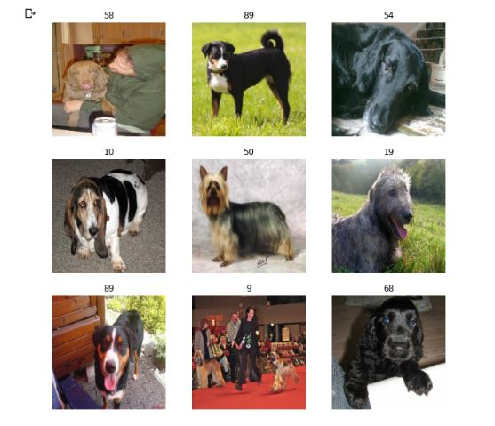
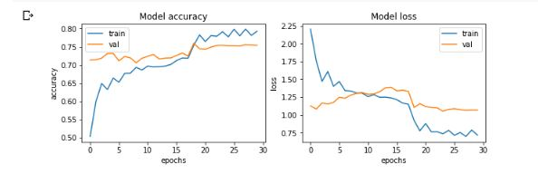

# Stanford-Dogs-Dataset
## About the Dataset :
The Stanford Dogs dataset contains images of 120 breeds of dogs from around the world. This dataset has been built using images and annotation from ImageNet for the task of fine-grained image categorization. It was originally collected for fine-grain image categorization, a challenging problem as certain dog breeds have near identical features or differ in colour and age.

- Number of categories: 120 
- Number of images: 20,580

## Solution :
Hey Reader,the py file of the solution can be found with the name " Stanford_dogs_py ".

In the py file , the commented section in the starting containes the pre-processing codes required to set up the google colab notebook as per requirements :
- Installing kaggle and setting up an API 
- Downloading the dataset zip file directly from the kaggle
- Unziping the dataset 

My core solution is based upon the concept of [transfer learning using the Inception V3 model](https://medium.com/analytics-vidhya/transfer-learning-using-inception-v3-for-image-classification-86700411251b).

### Random Sample of images from 120 classes :

### Final model consisted of the following layers :
- Inception V3
- Global Max Pooling 
- Dropout 
- Dense( Final output layer ) 

The paramters used were derived by various combinations of trial and error over the days. 

### Training Vs Validation ( Accuracy and Loss ) 

